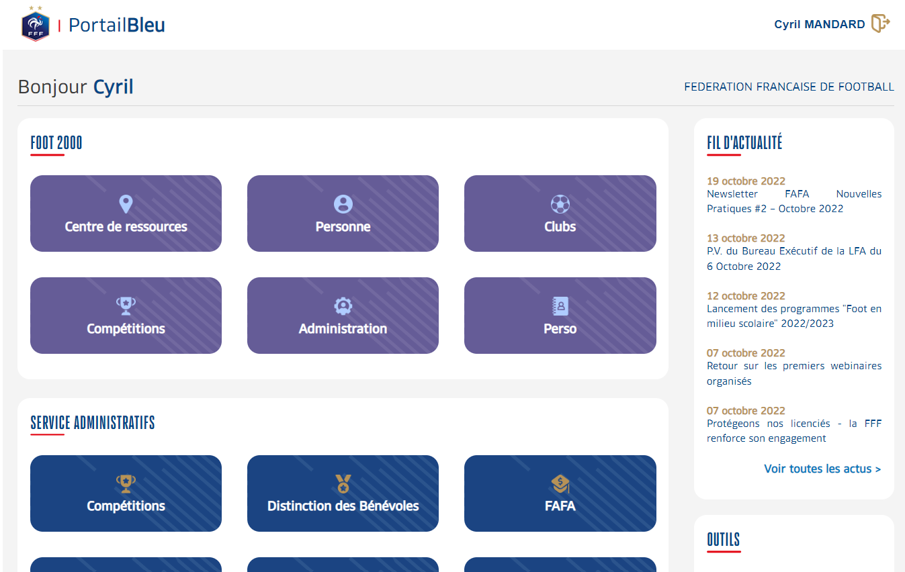

# FFF

## Frontend

*Portailbleu*

### Description:

This project is my first professional project in ReactJS without using any meta frameworks such as NextJS or NestJS.
All the work in the front-end is almost 100% done by me. The v1.0 is done within 1 day. The v1.1, a refactor of v1.0 is also done in 1 day. 
There are also some pull requests from other collaborators 
which are all well verified by me before merging into the code source.  
  Source code: 
- [frontend](https://github.com/CaoKha/portailbleu) (private)

### Technologies: 

ReactJS, Webpack, Nginx, FastAPI (Python)

## Fullstack
*Licence club federale*

### Description:
This project is more complicated so we finished it within 2 months.

  Source code: 
- [frontend](https://github.com/CaoKha/lcf-ui) (private)
- [backend](https://github.com/CaoKha/lcf-ws) (private)
### Technologies: 

Angular, FastAPI (Python), PostgreSQL
