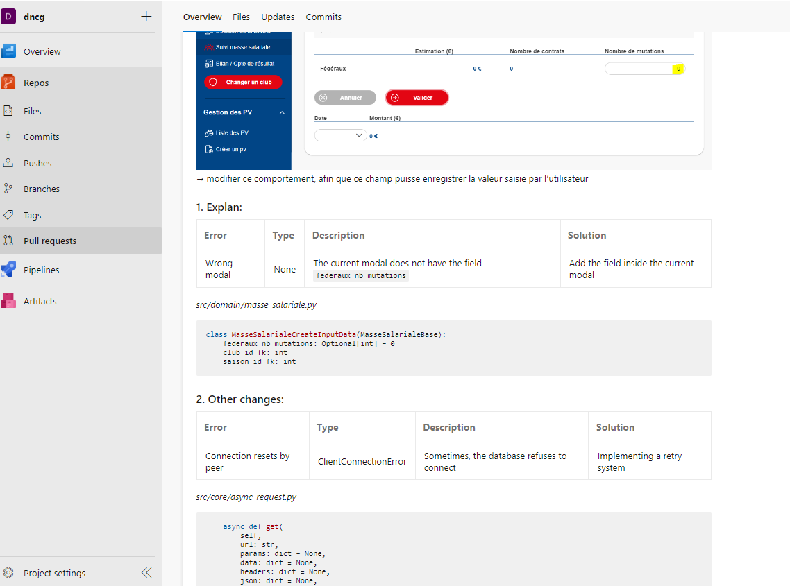

# Tools

These are some useful tools I learnt along the way.

- DevOps: 
[Ansible](https://docs.google.com/presentation/d/1vzc_-vSQrVtxI7siZi_-uo1fqQ26lgl3a5m2djxngHc/edit?usp=sharing), Github Action, Azure Pipeline
- Performance test tool: 
[Godbolt](https://godbolt.org/)
- IDE: [Neovim](https://neovim.io/), [VSCode](https://code.visualstudio.com/) 
- Documentation: [mdBook](https://rust-lang.github.io/mdBook/)
- Make use of markdown for pull request:

