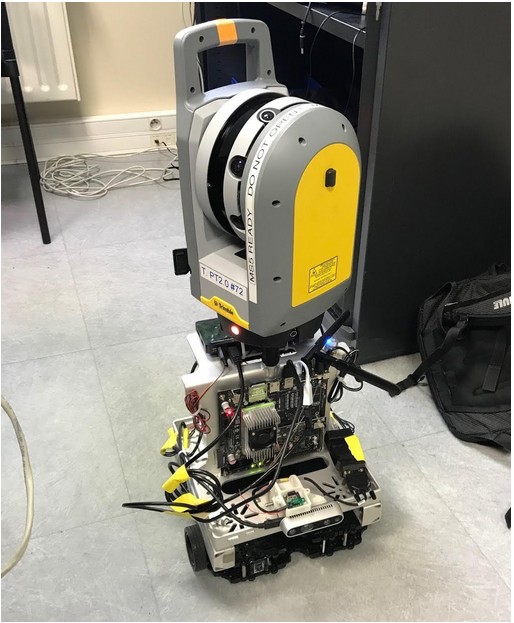
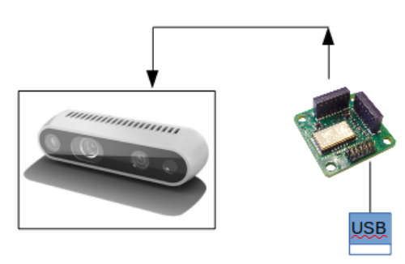
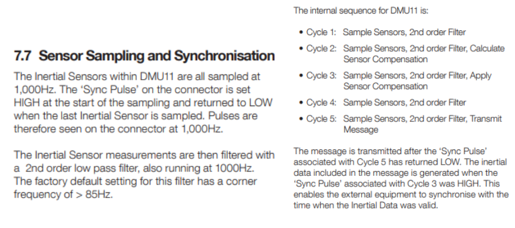
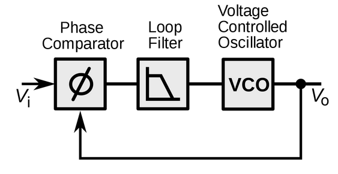
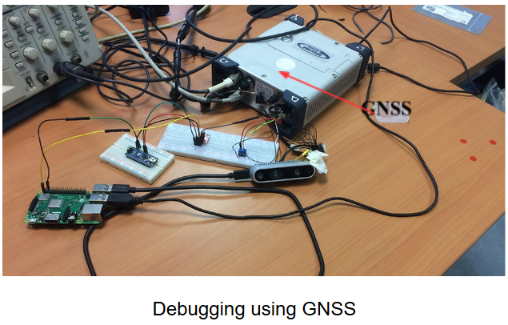
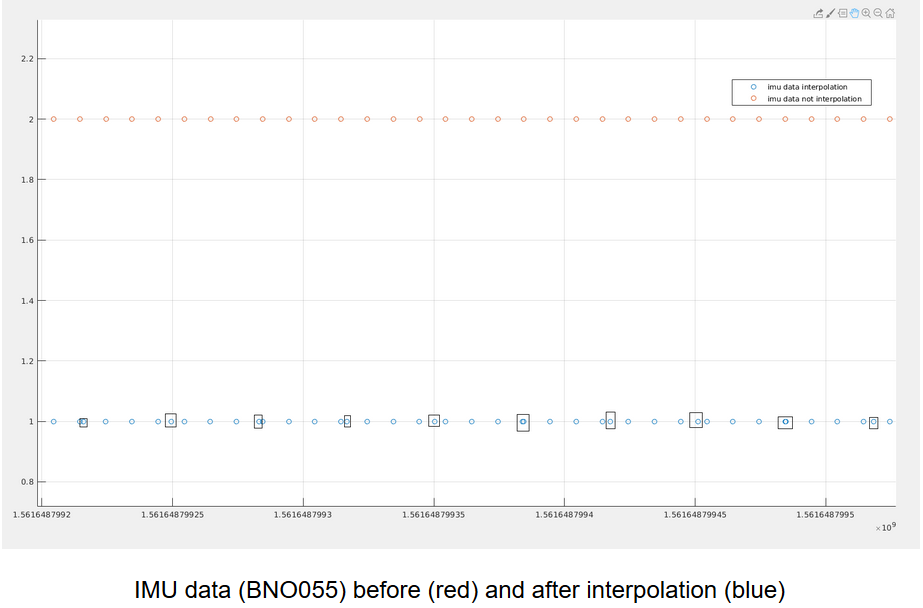

# Internship at Trimble

## Sensor Synchronization

Revan is a camera vision based project which will later be implemented on a forklift. The goal of this project is to achieve a localization with an error of less than 10 cm in indoor and outdoor environment. In order to realize this criteria, a robot was built using a camera, an IMU, a lidar and wheel encoders. These sensors are then fused together, which ameliorates the localization result.

My work in this project is sensor hardware synchronization, which is handling the data received from camera (D435) and the data received from IMU (DMU11), making them in sync thus reduce error in sensor fusion method.

### 1. Synchronize camera and IMU by putting the pulses from IMU to camera

In order to measure the signal coming from IMU, I used an oscilloscope and measure the signal coming out of the pin SYNC (pin 8) of the IMU

The fact is the signal that I got from pin 8 was not the 200 Hz ODR signal but rather a 1000 Hz pulse signal. The width of a pulse signal was 0.19 ms. This wasn’t a surprise because it was all written on the datasheet:

The pulses at 1000 Hz are the indication of the data raw having been available inside the DMU11 chip. The data raw is then filtered and sent to computer through an USB port at 200 Hz. Still, 1000 couldn’t be divided by 15/30/60/90 (which is the frame rates of camera) because of there is a factor of 3 inside those frequencies. Therefore, these signal could not be synchronized.

### 2. Phase locked loop

At the beginning, we thought that when we sent an electrical pulse at the camera, the camera would give us an image. However, the design wasn’t that simple. A camera is not a trigger-shoot device. It is designed to maintain its frame at certain frequencies. That is why in its datasheet, it is recommend sending the pulses at pin 8 at exactly the frequency running by the camera.

The camera used phased locked loop technique by comparing the phase of outsider signal and the current signal then correct the phase output of current signal to it. There is no option to adjust the camera, make it become trigger-shoot device. Therefore, we need to change our strategy. So now, let just time precisely the pulses and then interpolate the data

### 3. Risks when time stamping the pulses

Data is transported from a device to another device in 3 steps:

- Logging (Data-ready)

- Sending

- Receiving

Pulses are the indicator of data that are ready to be sent only but are not considered as an indicator of the event “data received”!

In order to verify my statement, I was using a GNSS as my clock to timestamps the pulse received from camera. Meanwhile, I wrote a testing code which timestamps images at each time I received one from the camera using timing library in C++. I observed there were an inconsistency between the time in millisecond dated with GNSS and the time in millisecond dated with C++ library. The camera was set at 30 Hz, which means I should receive a frame at each 33.33 ms. Observing the graphic I ploted using Octave, I noted there were some weird gaps of 66.66 ms between the data dated by C++ library. However, in the same plot, the pulses dated with GNSS showed a perfect uniform equally distributed time space among them. As a result, we could conclude that drop frame event has occurred. To explain, the camera was originally set to “auto exposure” hence, when the robot entered the dark, it took time to adjust frame before export it out of the camera.

Now, we can conclude that timestamping the pulse isn’t a good choice because of its unreliability to guarantee data reception.

### 4. Interpolation

To have two data from camera and IMU at the same time without synchronization, interpolation was perhaps a solution to be considered. Nevertheless, is this method easy to be implemented and functioned in real time?

Interpolation is defined as the construction of new data points within the range of a discrete set of known data points. We were dealing with the time, which always increments. We could not stop the program in order to look back into the pass then create new data points. In the first glance, we might see that the interpolation method was not a real time method for this application. However, ROS data handling structure provided us such a way to overcome this issue. Remember that the timestamps were marked onto the data before being sent to ROS. For that reason, we could easily manipulate the data and its timestamp before sending it to ROS.

The algorithm could be explained in brief as below:

- First, detect the data and timestamp of IMU right before an image was received.

- At each time we received an image, we marked its time.

- Next, we wait until we received the next data from IMU, mark its time too.

- The last thing to do is create the new IMU data at the time we received the image.

- We loop this process until the end of the program.

As you might see on the picture above, I have succeeded to do it with bno055 IMU (100 Hz) and Realsense D435 camera set at 30 Hz. Though, the data order was first sent to ROS in chaos. However, with a little twist in the way we publish the data onto ROS, the data order was then fixed to the correct order.

### 5. Extrapolation vs Interpolation

Extrapolation allows us to predict the future data based on its behavior in the pass. Though, it is very bad for consequently changing trajectory movement such as the movement of a robot in XY plane.

This method was faster than interpolation but because of its ugly precision, this wasn’t the best way to approach our problem, whose goal is to reduce the error to less than 10 cm in navigation.

### 6. Conclusion:

Calibration and synchronization are two important techniques when working with sensors. The goal of this project is to synchronize the sensors (camera and IMU) together. My tutor believe that the solution to the problem was by using the electrical pulse from the IMU as a trigger to camera, the camera then received the signal and output an image. After several experiments, it was revealed that the camera working principle does not support the first method. To overcome this issue, a pulse generator was used to control working rhythm of both the camera and the IMU. However, the IMU embedded design was not allowed itself to be configured as a slave in order to be controlled by the pulse generator. The only option left was using a high-level programming language such as C++ and ROS to manipulate the data and their timestamps of each sensors. Although, the accuracy of this method suffered from latency and throughput of their data stream outputs.

Approach by software was considered from beginning as an imprecise technique because timing using a not real time operative system is the worst method ever. Though, multi-tasks was required for this application and the operative system offered multi-threads programming, which got the job done very quickly. Because of underivable frequency characteristic of the sensors, interpolation method was proposed and succeeded to implement in soft real time. The synchronization problem is solved but the precision and stability of the method has yet been optimized to their limit.

### 7. Source code: 
[https://github.com/CaoKha/Synchronization](https://github.com/CaoKha/Synchronization)
